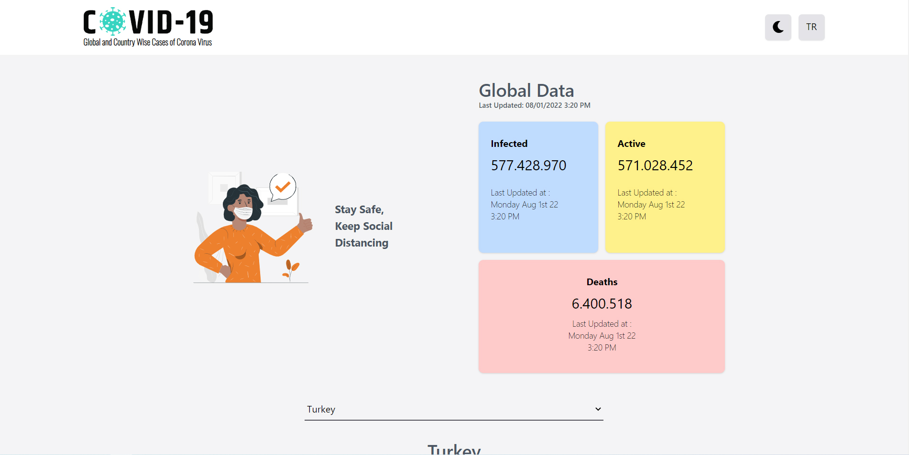
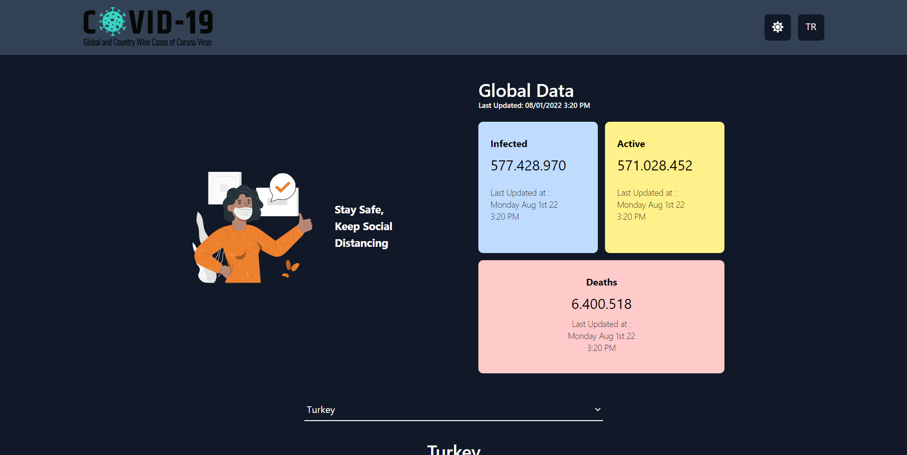
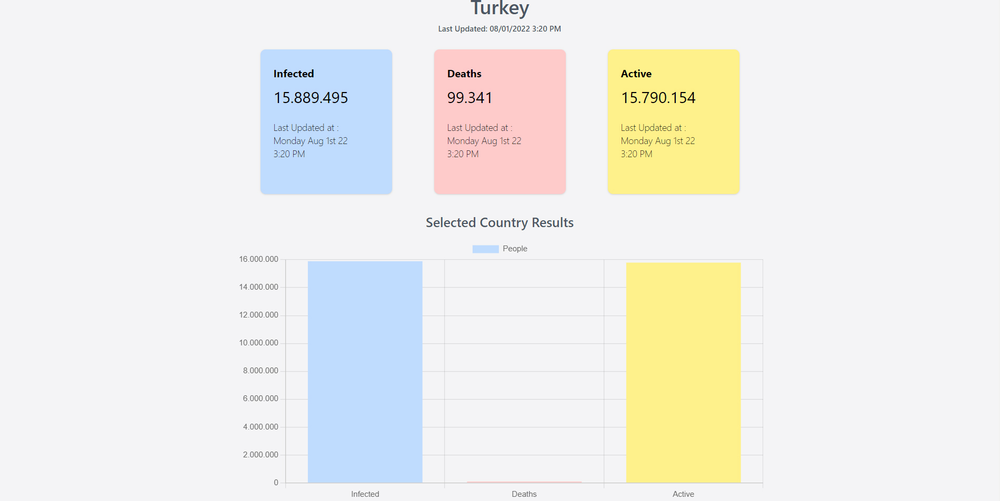
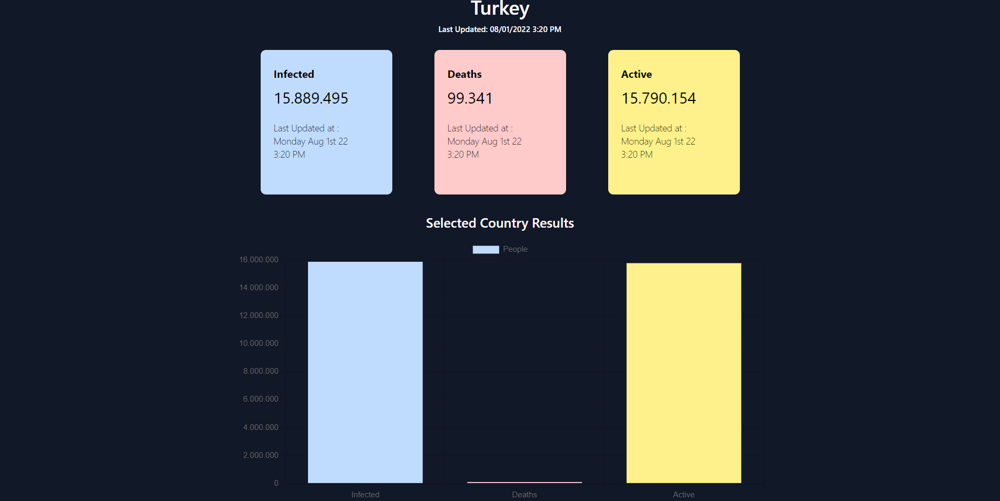

# 🦠 Covid-19 Tracker with React

* Patika.dev Redux module "Covid-19 Tracker" project.

## :sparkles: Live Demo

[]()

## :computer: Setup

1. Clone the repository and install its features.

```
npm install or yarn install
```

2. Use the project locally (localhost).

```
npm start or yarn start
```

## Project Features

:heavy_check_mark: State management with Redux <br />
:heavy_check_mark: Dark and light theme <br />
:heavy_check_mark: English and Turkish language option <br />
:heavy_check_mark: Global data results <br />
:heavy_check_mark: Selected country data results <br />
:heavy_check_mark: Graphic representation of the selected country <br />

## :fire: Technologies and Libraries

:point_right: React.js <br />
:point_right: Redux <br />
:point_right: Redux Toolkit <br />
:point_right: Axios <br />
:point_right: Tailwind CSS <br />
:point_right: Moment.js <br />
:point_right: React-Icons <br />
:point_right: React-CountUp <br />
:point_right: React-Chartjs-2 <br />

## Screenshot




